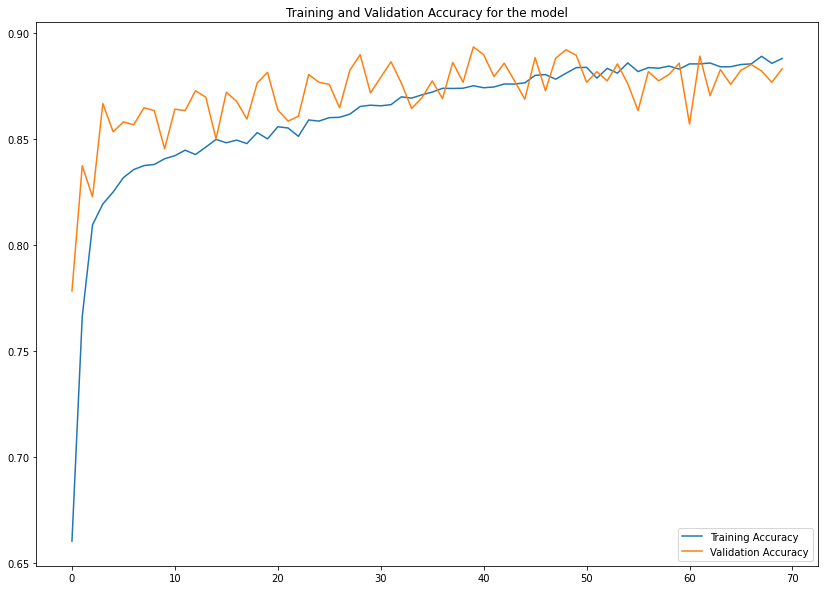

# **Galaxy-Classification-using-CNN**

Authors [Sayan Hazra](https://github.com/sayan0506) & [Sankalpa Chowdhury](https://github.com/sankalpachowdhury)

# Problem Statement :
Understanding how and why we are here is one of the fundamental questions for the human race. Part of the answer to this question lies in the origins of galaxies, such as our own Milky Way. Yet questions remain about how the Milky Way (or any of the other ~100 billion galaxies in our Universe) was formed and has evolved. Galaxies come in all shapes, sizes and colors: from beautiful spirals to huge ellipticals. Understanding the distribution, location and types of galaxies as a function of shape, size, and color are critical pieces for solving this puzzle. [(Source)](https://www.kaggle.com/c/galaxy-zoo-the-galaxy-challenge/overview/description)

With each passing day telescopes around and above the Earth capture more and more images of distant galaxies. As better and bigger telescopes continue to collect these images, the datasets begin to explode in size. In order to better understand how the different shapes (or morphologies) of galaxies relate to the physics that create them, such images need to be sorted and classified.

Galaxies in this set have already been classified once through the help of hundreds of thousands of volunteers, who collectively classified the shapes of these images by eye in a successful citizen science crowdsourcing project. However, this approach becomes less feasible as data sets grow to contain of hundreds of millions (or even billions) of galaxies. Here we implemet a deep learning model to classify huge number of galaxies with high accuracy. 

# **How to use this repository?**

# **Dataset**
Data preperation and segrigation are done based on decision tree referenced from [Kaggle](https://www.kaggle.com/c/galaxy-zoo-the-galaxy-challenge/overview/the-galaxy-zoo-decision-tree).

* **Dataset Source:** 

The Dataset is hosted on a kaggle challenge. [Galazy Zoo](https://www.kaggle.com/c/galaxy-zoo-the-galaxy-challenge/data)

* **Decision tree** [Galaxy zoo2 Paper](https://arxiv.org/abs/1308.3496)

The Galaxy zoo 2 survey was done based on some interconnected decision steps of significant questions, as shown: 

**Weighting the responses**

For the first set of responses (smooth, features/disk, star/artifact), the values in each category are simply the likelihood of the galaxy falling in each category, are summed to 1.0. For each subsequent question, the probabilities are first computed (these will sum to 1.0) and then multiplied by the value which led to that new set of responses. 

Example: Suppose for a galaxy 80% of users identify it as smooth, 15% as having features/disk, and 5% as a star/artifact.

        
        Class1.1 = 0.80
        Class1.2 = 0.15
        Class1.3 = 0.05
        
For the 80% of users that identified the galaxy as "smooth", they also recorded responses for the galaxy's relative roundness. These votes were for 50% completely round, 25% in-between, and 25% cigar-shaped. The values in the solution file are thus:

        Class 7.1 = 0.80 * 0.50 = 0.40
        Class 7.2 = 0.80 * 0.25 = 0.20
        Class 7.3 = 0.80 * 0.25 = 0.20

The reason for this weighting is to emphasize that a good solution must get the high-level, large-scale morphology categories correct. The best solutions, though, will also have high levels of accuracy on the detailed solutions that are further down the decision tree.

Based on that referenced decision tree concept the images are segregated into three main classes of Hubbles Tuning fork, which are  

**1. Elliptical, 2. Lenticular, 3. Spiral**

* **Image Data** 

[Source](https://www.kaggle.com/c/galaxy-zoo-the-galaxy-challenge/data?select=images_training_rev1.zip) contains 65000 images of galaxies.
Image file (.jpeg) of 424 x 424 RGB
Galaxy ids are used as galaxy image name.

* **Labels** 

Based on the survey as recorded in the [training_solutions_rev1.csv](https://www.kaggle.com/c/galaxy-zoo-the-galaxy-challenge/data?select=training_solutions_rev1.zip) the galaxy ids are classified into three mentioned category with the help of referenced concepts in **weighting and responses** section, and the following decision tree architecture mentioned in the Galaxy zoo 2 paper.

**NOTE: *Galaxy-IDs are used to map images to the respective labels.* ** 

* **Train-Test split**

The dataset of images is segmented into `Train` and `Validation` sets. ~90% of the images are taken into `Training` set and the remaining for the `Validation` set.

# **Preprocessing**
* **Data Classification and image segregation**   

   **Classification**
    * The recorded survey is loaded into a dataframe from the csv.
    * Based on the decision tree the galaxy ids corresponding to the three classes are stored into three lists.
   
   **Images segregation**
    * The galaxy images are segregated into three different folders of named corresponding to the classes with the help of lists returned from the previous step.   

* **Image Augmentation**

  Image augmentation technique is used as preprocessing technique using the **Augmentor** class of tensorflow, which helps to reduce the overfitting problem.
  
  **Augmentation techniques used**
        
     **1.   Rotation**
     
     * Rotate 90 degree(Probability = 0.5)
        
     * Rotate 270 degree(Probability = 0.5)
        
     **2.   Mirroring**
     
     * Horizontal flip(Probability = 0.5)
     
     * Vertical flip(Probability = 0.5)
        
     **3.   Resizing**
  
     * Augmented image size = (150,150) | (Probability = 0.5)
     
     Target training samples after augmentation = 8000 for each class,\
     Target validation samples after augmentation = 1000 for each class

# **Models**

The galaxy classification problem is solved by Deep Learning classification methods, using Convolutional Neural Networks (CNN). The CNN models are known to work well with image classification problems. Here, different model architectures are used with different combinations of hyperparameters. The model architectures used are defined in details in the colab notebooks [Tested models](https://github.com/sankalpachowdhury/Galaxy-Classification-using-CNN/tree/master/Model%20testing). After testing with several custom models including open source models like ResNet50. After evaluating the model performances, two optimal models are selected, whose architectures are given below-->

*Model 1 architecture (sequential)*
---
*  Filter shape: (3,3)

*  Pool shape(Constant): (2,2)

*  Input shape: (150,150)

*  Batch Normalization parameters(default):
   
   * momentum = 0.99,
   
   * epsilon = 0.001,
   
   * renorm_momentum = 0.99

>**Layer1:** 
>
>a. Convolution: No. of filters: 32, 
>   Activation: RELU, 
>   Batch normalization
>
>b. Max-pool

>**Layer2:** 
>
>a. Convolution: No. of filters: 32, 
>   Activation: RELU, 
>   Batch normalization
>   
>b. Max-pool

>**Layer3:** 
>
>a. Convolution: No. of filters: 64, 
>   Activation: RELU, 
>   Batch normalization
>
>b. Max-pool

>**Layer4:** 
>
>a. Convolution: No. of filters: 64, 
>   Activation: RELU, 
>   Batch normalization
>
>b. Max-pool 

>**Layer5:** 
>
>a. Convolution: No. of filters: 128, 
>   Activation: RELU
>
>b. Max-pool

>**Layer6:** Flatten

>**Layer7:**
>
>Fully connected layer: No. of nodes: 512, Activation: RELU

>**Layer8:**
>
>Fully connected layer: No. of nodes: 128, Activation: RELU

>**Output layer:**
>
>Softmax layer: No. of units: 3, Activation: Softmax

---

*Model 2 architecture (sequential)*
---
*  Filter shape: (3,3)

*  Pool shape(Constant): (2,2)

*  Input shape: (150,150)

*  Batch Normalization parameters(default):
   
   * momentum = 0.99,
   
   * epsilon = 0.001,

   * renorm_momentum = 0.99

>**Layer1:** 
>
>a. Convolution: No. of filters: 64, 
>   Activation: RELU, 
>
>b. Max-pool

>**Layer2:** 
>
>a. Convolution: No. of filters: 64, 
>   Activation: RELU, 
>   
>b. Max-pool

>**Layer3:** 
>
>a. Convolution: No. of filters: 128, 
>   Activation: RELU, 
>
>b. Max-pool

>**Layer4:** 
>
>a. Convolution: No. of filters: 128, 
>   Activation: RELU, 
>
>b. Max-pool 

>**Layer5:** 
>
>a. Convolution: No. of filters: 128, 
>   Activation: RELU
>
>b. Max-pool

>**Layer6:** Flatten

>**Layer7:** Dropout layer(Probability = 0.5)

>**Layer8:**
>
>Fully connected layer: No. of nodes: 512, Activation: RELU

>**Output layer:**
>
>Softmax layer: No. of units: 3, Activation: Softmax

The two models are implemented using Keras and Tensorflow. The details of model implementations and performances comparison can be found in the [Galaxy_classification_CNN_model_comparisons_26_08_20](https://github.com/sankalpachowdhury/Galaxy-Classification-using-CNN/blob/master/Galaxy-Classification%20CNN%20models/Galaxy_classification_CNN_model_comparisons_26_08_20.ipynb). 

# **Training**

**Model compilation and Introducing optimization technique**

*   Optimizer: **Adam**(Learning rate = 0.001, beta1 = 0.9, beta2 = 0.999, epsilon = 1e-07 
*   Cost function: Categorical cross entropy
*   metrics : Accuracy

**Implementing Callbacks**

* In the custom callback function **myCallback**, baseline **val_loss** is taken as **0.2500**, after that this custom callback will be executed  to stop the training.

* The best model will be stored inside **best_model.h5** file with the help of **ModelCheckpoint** callback argument, 

**Training the Model**

* Training is implemented using fit_generator

> *Arguments :*
* **Training data**: train_generator (Contains train data) 
* **Validation data**: validation_generator (Contains validation data)
* **Epochs**: 140 (Because google colab buffer memory restriction, the model was run for two times sequentially (70 + 70).
* **Callbacks**: Custom_callback, Model_checkpoint 
* **Verbose**: 1

History of the model training is stored for the analysis.

>Early Stopping object, where earlystopping baseline was taken 0.2791 for validation loss, but not used
>Instead, custom callback was implemented for the model

**Hyperparameters:** 

* **Minibatch size: 64**
* **Epochs: 10**
* **Steps per Epochs : 8**
* **Optimizer :** ***Adam***
* **Learning Rate : 0.001**
* **Loss function :** ***Categorical Cross Entropy***

# **Testing**

# **Analysis**

The model trainings are visualized in the colab notebook, which indicates that the *Model 2* performance is much stable than *Model 1*, which validates *Model 2* to be finalized. The implementation of *Model 2* has been done in a seperate notebook [Galaxy_classification_CNN_final_model_26_08_20](https://github.com/sankalpachowdhury/Galaxy-Classification-using-CNN/blob/master/Galaxy-Classification%20CNN%20models/Galaxy_classification_CNN_final_model_26_08_20.ipynb).

The final model training performance is given below:

# **Reference**
1. https://blog.galaxyzoo.org/category/paper/
2. Kaggle Galaxy zoo competition guide: https://github.com/benanne/kaggle-galaxies
