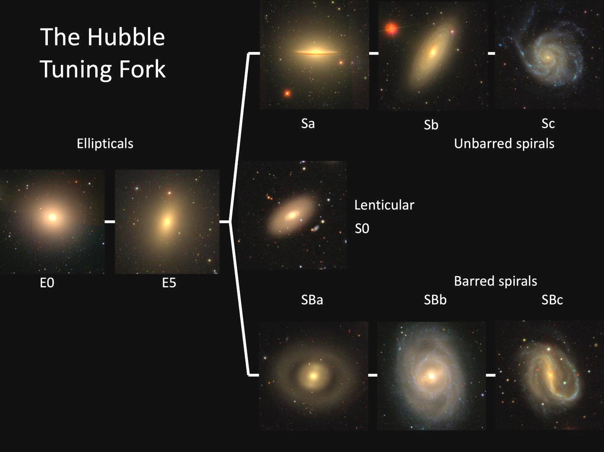
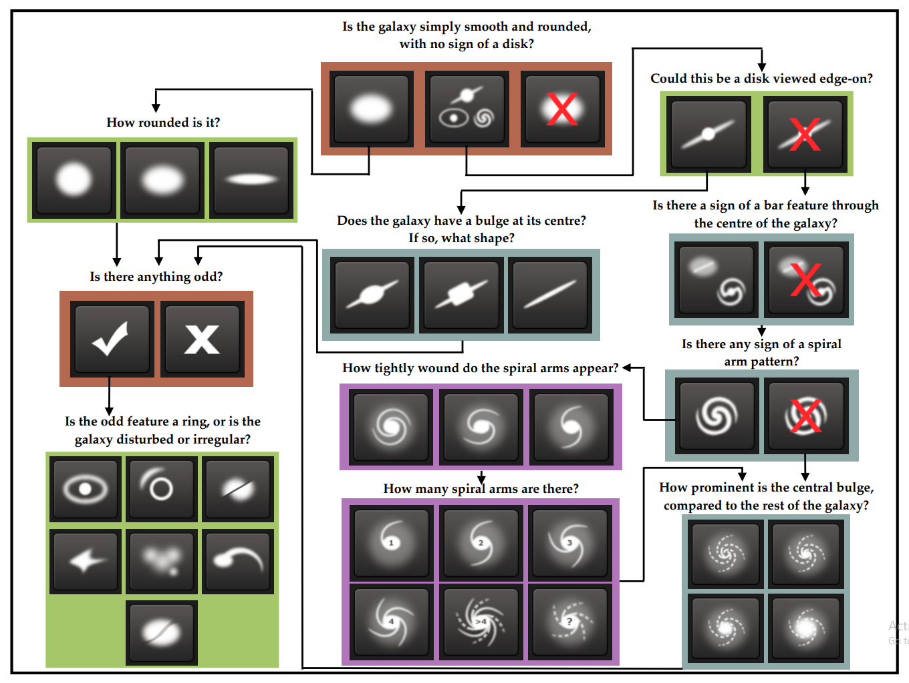

# **Galaxy-Classification-using-CNN**

Authors [Sayan Hazra](https://github.com/sayan0506) & [Sankalpa Chowdhury](https://github.com/sankalpachowdhury)

# Problem Statement :
Understanding how and why we are here is one of the fundamental questions for the human race. Part of the answer to this question lies in the origins of galaxies, such as our own Milky Way. Yet questions remain about how the Milky Way (or any of the other ~100 billion galaxies in our Universe) was formed and has evolved. Galaxies come in all shapes, sizes and colors: from beautiful spirals to huge ellipticals. Understanding the distribution, location and types of galaxies as a function of shape, size, and color are critical pieces for solving this puzzle. [(Source)](https://www.kaggle.com/c/galaxy-zoo-the-galaxy-challenge/overview/description)

With each passing day telescopes around and above the Earth capture more and more images of distant galaxies. As better and bigger telescopes continue to collect these images, the datasets begin to explode in size. In order to better understand how the different shapes (or morphologies) of galaxies relate to the physics that create them, such images need to be sorted and classified.

Galaxies in this set have already been classified once through the help of hundreds of thousands of volunteers, who collectively classified the shapes of these images by eye in a successful citizen science crowdsourcing project. However, this approach becomes less feasible as data sets grow to contain of hundreds of millions (or even billions) of galaxies. Here we implemet a deep learning model to classify huge number of galaxies with high accuracy. 

**Classify Galaxy**
Data : Image file (.jpeg) of 424 x 424 RGB
Source : 

Step 1: Data Importing:  

        1. Import Data --> 500 images for Train set || 100 for test set
        
        2. Labeling part.
        
        3. Train test split

Step 2: Data Pre-processing :

        1. Resize images down to A[0] 69, 69, 3
        
        2. Rotation (Uniform) random [0 ,360] (degree)
        
        3. Translation --> random uniform -4 to +4
        
        4. Zoom --> 1/1.3 to 1.3 Log uniform
        
        5. Flip --> Yes or No, Bernoulli sequence
        
        6. * Colour Peturbation (PCA) and Realtime Augmentation
        
        7. Centering and rescaling --> 
        
Step 3: Model Architecture :

        sequential Keras model
        
        model --> input layer : 69, 69, 3 ~ input_shape=(IMG_SHAPE[0], IMG_SHAPE[1], 3))
        
        layer 1 : Conv2d :  32  filter size: 6, 6
        
        layer 2 : Conv2d :  64 filter size : (3,3)
        
        layer * : Pooling : 20, 20
        
        layer 3 : Conv2d :  128 filter size: (3, 3)
        
        layer * : Conv2d :  128 filter size: (3, 3)
        
        layer 4 : Pooling : 2, 2
        
        layer 6 : Flatten : 
        
        layer 7 : Fc 1:     512
        
        layer 8 : Fc 2:     512
        
        layer 9 : Output layer: softmax -- 37 
        
        
   
Hyperparameters: 

Minibatch size: 64
Epochs: 10
Steps per Epochs : 8

Optimizer : Adam // RMSProp

Learning Rate : 0.001

Loss function : Categorical Cross Entropy

# **How to use this repository?**

# **Dataset**
Data preperation and segrigation are done based on decision tree referenced from [Kaggle](https://www.kaggle.com/c/galaxy-zoo-the-galaxy-challenge/overview/the-galaxy-zoo-decision-tree).

* **Dataset Source:** 

The Dataset is hosted on a kaggle challenge. [Galazy Zoo](https://www.kaggle.com/c/galaxy-zoo-the-galaxy-challenge/data)

* **Decision tree** [Galaxy zoo2 Paper](https://arxiv.org/abs/1308.3496)

The Galaxy zoo 2 survey was done based on some interconnected decision steps of significant questions, as shown: 

**Weighting the responses**

For the first set of responses (smooth, features/disk, star/artifact), the values in each category are simply the likelihood of the galaxy falling in each category, are summed to 1.0. For each subsequent question, the probabilities are first computed (these will sum to 1.0) and then multiplied by the value which led to that new set of responses. 

Example: Suppose for a galaxy 80% of users identify it as smooth, 15% as having features/disk, and 5% as a star/artifact.
`
Class1.1 = 0.80
Class1.2 = 0.15
Class1.3 = 0.05
`
For the 80% of users that identified the galaxy as "smooth", they also recorded responses for the galaxy's relative roundness. These votes were for 50% completely round, 25% in-between, and 25% cigar-shaped. The values in the solution file are thus:
`
Class 7.1 = 0.80 * 0.50 = 0.40
Class 7.2 = 0.80 * 0.25 = 0.20
Class 7.3 = 0.80 * 0.25 = 0.20
`
The reason for this weighting is to emphasize that a good solution must get the high-level, large-scale morphology categories correct. The best solutions, though, will also have high levels of accuracy on the detailed solutions that are further down the decision tree.

Based on that referenced decision tree concept the images are segregated into three main classes of Hubbles Tuning fork, which are  

**1. Elliptical, 2. Lenticular, 3. Spiral**

* **Image Data** 

[Source](https://www.kaggle.com/c/galaxy-zoo-the-galaxy-challenge/data?select=images_training_rev1.zip) contains 65000 images of galaxies.
Image reolution: (424, 424)
Galaxy ids are used as galaxy image name.

* **Labels** 

Based on the survey as recorded in the [training_solutions_rev1.csv](https://www.kaggle.com/c/galaxy-zoo-the-galaxy-challenge/data?select=training_solutions_rev1.zip) the galaxy ids are classified into three mentioned category with the help of referenced concepts in **weighting and responses** section, and the following decision tree architecture mentioned in the Galaxy zoo 2 paper.

**NOTE: *Galaxy-IDs are used to map images to the respective labels.* ** 

* **Train-Test split**

The dataset of images is segmented into `Train` and `Validation` sets. ~90% of the images are taken into `Training` set and the remaining for the `Validation` set.

# **Preprocessing**
* **Data Classification and image segregation**   

   **Classification**
    * The recorded survey is loaded into a dataframe from the csv.
    * Based on the decision tree the galaxy ids corresponding to the three classes are stored into three lists.
   
   **Images segregation**
    * The galaxy images are segregated into three different folders of named corresponding to the classes with the help of lists returned from the previous step.   

* **Image Augmentation**

  Image augmentation technique is used as preprocessing technique using the **Augmentor** class of tensorflow, which helps to reduce the overfitting problem.
  
  **Augmentation techniques used**\
        **1.   Rotation**\
          * Rotate 90 degree(Probability = 0.5)\
          * Rotate 270 degree(Probability = 0.5)\
        **2.   Mirroring**\
          * Horizontal flip(Probability = 0.5)\
          * Vertical flip(Probability = 0.5)\
        **3. Resizing**\
          * Augmented image size = (150,150) | (Probability = 0.5)\
        Target training samples after augmentation = 8000 for each class,\
        Target validation samples after augmentation = 1000 for each class

# **Model**

# **Training**

# **Testing**

# **Analysis**

# **Reference**
1. https://blog.galaxyzoo.org/category/paper/
2. Kaggle Galaxy zoo competition guide: https://github.com/benanne/kaggle-galaxies
