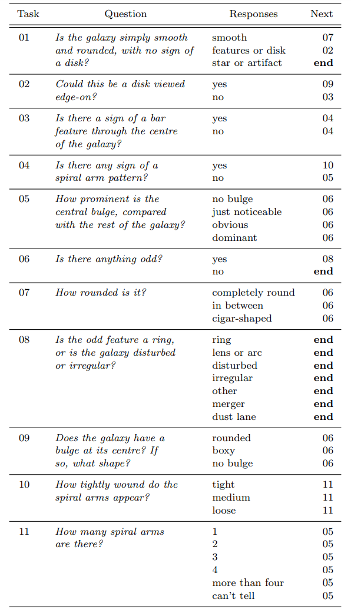

# Galaxy-Classification-using-CNN

-Sayan Hazra & Sankalpa Chowdhury

Imp links:
1. https://blog.galaxyzoo.org/category/paper/
2. Kaggle Galaxy zoo competition guide: https://github.com/benanne/kaggle-galaxies

#Problem Statement :
**Classify Galaxy**

Data : Image file (.jpeg) of 424 x 424 RGB
Source : 

Step 1: Data Importing:  

        1. Import Data --> 500 images for Train set || 100 for test set
        
        2. Labeling part.
        
        3. Train test split

Step 2: Data Pre-processing :

        1. Resize images down to A[0] 69, 69, 3
        
        2. Rotation (Uniform) random [0 ,360] (degree)
        
        3. Translation --> random uniform -4 to +4
        
        4. Zoom --> 1/1.3 to 1.3 Log uniform
        
        5. Flip --> Yes or No, Bernoulli sequence
        
        6. * Colour Peturbation (PCA) and Realtime Augmentation
        
        7. Centering and rescaling --> 
        
Step 3: Model Architecture :

        sequential Keras model
        
        model --> input layer : 69, 69, 3 ~ input_shape=(IMG_SHAPE[0], IMG_SHAPE[1], 3))
        
        layer 1 : Conv2d :  32  filter size: 6, 6
        
        layer 2 : Conv2d :  64 filter size : (3,3)
        
        layer * : Pooling : 20, 20
        
        layer 3 : Conv2d :  128 filter size: (3, 3)
        
        layer * : Conv2d :  128 filter size: (3, 3)
        
        layer 4 : Pooling : 2, 2
        
        layer 6 : Flatten : 
        
        layer 7 : Fc 1:     512
        
        layer 8 : Fc 2:     512
        
        layer 9 : Output layer: softmax -- 37 
        
        
   
Hyperparameters: 

Minibatch size: 64
Epochs: 10
Steps per Epochs : 8

Optimizer : Adam // RMSProp

Learning Rate : 0.001

Loss function : Categorical Cross Entropy

# **Dataset**

# **Preprocessing**

# **Model**

# **Training**

# **Testing**

# **Analysis**

# **Reference**
